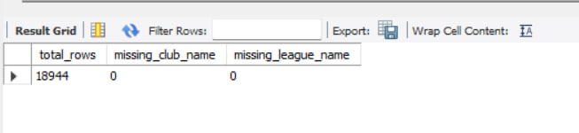
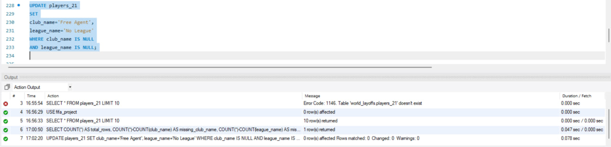
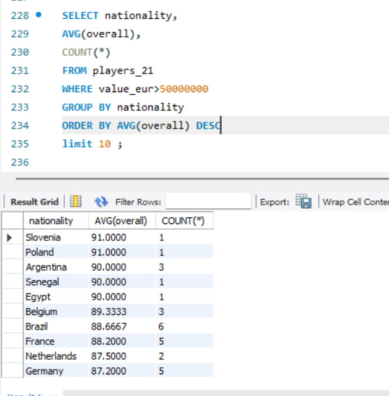
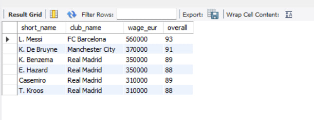
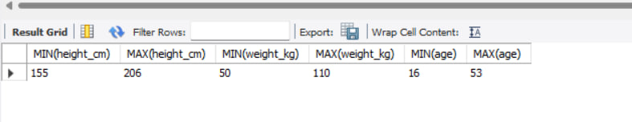

# ⚽ FIFA Players Data Cleaning & SQL Analysis

## 📌 Project Overview

This project focuses on SQL data exploration, data cleaning, and data analysis using the FIFA 21 Players dataset.

The objective was to clean inconsistent data, handle missing values, and answer business-oriented questions using SQL queries.

---

## 📊 Dataset

- Dataset: FIFA 21 Players Dataset
- Number of records: 18,944 players
- SQL Database: MySQL
- Tool: MySQL Workbench

---

## 🎯 Project Objectives

- Explore the dataset
- Identify missing values
- Clean inconsistent data
- Perform descriptive analysis
- Answer business questions using SQL
- Practice SQL aggregation and filtering techniques

---

## 🛠️ SQL Skills Demonstrated

- SELECT
- WHERE
- ORDER BY
- GROUP BY
- HAVING
- COUNT()
- AVG()
- SUM()
- MIN()
- MAX()
- UPDATE
- Aggregate Functions
- Data Cleaning

---

## 🧹 Data Cleaning Process

The following cleaning tasks were completed:

- Identified missing values
- Detected NULL values
- Replaced missing club names with **"Free Agent"**
- Replaced missing league names with **"No League"**
- Verified the cleaning process

---

## 📈 Business Questions Answered

Some examples of SQL analyses include:

- Which nationalities have the highest average player value?
- Which clubs pay the highest average salaries?
- Which players earn unusually high wages?
- Which players have no club but still have high ratings?
- What are the minimum and maximum player statistics?
- Which nationalities have the highest average overall rating among players worth more than €50 million?

---
## 📌 Project Results

During this project, I successfully:

- Cleaned missing values from the dataset
- Replaced missing club and league names
- Explored more than 18,000 player records
- Answered business-oriented questions using SQL
- Applied aggregate functions and filtering techniques
- Improved my SQL querying and data analysis skills

## 📷 Project Screenshots

### Dataset Overview


---

### Missing Values Analysis



---

### Data Cleaning



---

### Top Nationalities Analysis



---

### High Salary Players



---

### Player Statistics



---

## 📁 Project Structure

```
FIFA-Players-Data-Cleaning/
│
├── dataset/
│   └── players_21.csv
│
├── sql/
│   └── 03_data_analysis.sql
│
├── screenshots/
│   ├── 01_dataset_overview.jpg
│   ├── 02_missing_values.jpg
│   ├── 03_data_cleaning.jpg
│   ├── 04_top_10_nationality.jpg
│   ├── 05_high_salary_players.jpg
│   └── 06_players_statistics.jpg
│
└── README.md
```

---

## 🚀 Author

**Barry Arona**

Aspiring Data Analyst | SQL | Python | Power BI | Tableau
